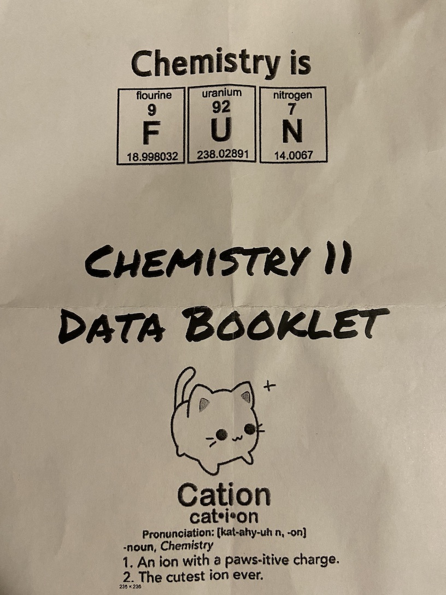
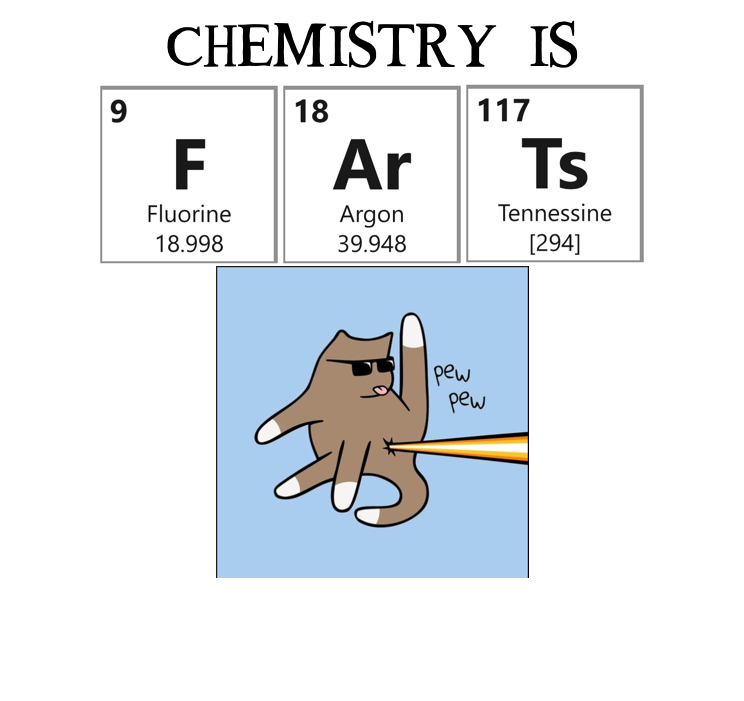

# Periodic Words

Have you ever wondered which words you can spell using only element abbreviations from the periodic table?

Well thanks to this extremely important software I have written, you can set that wonder free.

My daughter came home with this handout



This proves that in fact Chemistry is FUN.
So I replied with this. It's important to engage with your child's teacher.



The Chemistry building was a major thoroughfare at my university and I was thinking of all the esters labs that ruined my appetite on the way to lunch.

Still curious, I wrote this command line utility.

# Usage

Check a single word:
```shell
$ periodic-words -w oversaturation
oversaturation "[Oxygen][Vanadium][Erbium][Sulfur][Astatine][Uranium][Radium][Titanium][Oxygen][Nitrogen]"
```

Or you can provide a word list to check. You probably already have one on your system:
```shell
$ periodic-words -f /usr/share/dict/words
```

Here is another source of word lists in a few languages: https://github.com/lorenbrichter/Words

Now I'm sure you're wondering if any of the names of the elements can themselves be written out using the element abbreviations. 

```shell
silver "[Sulfur][Iodine][Livermorium][Erbium]"
copper "[Carbon][Oxygen][Phosphorus][Phosphorus][Erbium]"
oganesson "[Oxygen][Gallium][Nitrogen][Einsteinium][Sulfur][Oxygen][Nitrogen]"
silicon "[Sulfur][Iodine][Lithium][Carbon][Oxygen][Nitrogen]"
tin "[Titanium][Nitrogen]"
```

Carbon and Xenon do it starting with their own element.

```shell
carbon "[Carbon][Argon][Boron][Oxygen][Nitrogen]"
xenon "[Xenon][Nitrogen][Oxygen][Nitrogen]"
```

Phosphorous is the only one that refers to itself twice
```shell
phosphorus "[Phosphorus][Hydrogen][Oxygen][Sulfur][Phosphorus][Hydrogen][Oxygen][Ruthenium][Sulfur]"
```

You can check this yourself using the `elements-as-a-word-list.txt` file in this repo.

If you're writing a Chemistry textbook, I bet you could find a way to use this for each of your chapter titles

```shell
Chemistry is brew "[Boron][Rhenium][Tungsten]"
Chemistry is concoction "[Carbon][Oxygen][Nitrogen][Carbon][Oxygen][Carbon][Titanium][Oxygen][Nitrogen]"
Chemistry is dynamite "[Dysprosium][Nitrogen][Americium][Iodine][Tellurium]"
Chemistry is fractionation "[Fluorine][Radium][Carbon][Titanium][Oxygen][Nitrogen][Astatine][Iodine][Oxygen][Nitrogen]"
Chemistry is gasses "[Gallium][Sulfur][Sulfur][Einsteinium]"
Chemistry is esterases "[Einsteinium][Tellurium][Radium][Sulfur][Einsteinium]"
Chemistry is pressure "[Phosphorus][Rhenium][Sulfur][Sulfur][Uranium][Rhenium]"
Chemistry is salts "[Sulfur][Aluminium][Tennessine]"
Chemistry is the solution "[Sulfur][Oxygen][Lutetium][Titanium][Oxygen][Nitrogen]"
Chemistry is synthesis "[Sulfur][Yttrium][Nitrogen][Thorium][Einsteinium][Iodine][Sulfur]"
Chemistry is oversaturation "[Oxygen][Vanadium][Erbium][Sulfur][Astatine][Uranium][Radium][Titanium][Oxygen][Nitrogen]"
Chemistry is supersaturate "[Sulfur][Uranium][Phosphorus][Erbium][Sulfur][Astatine][Uranium][Radium][Tellurium]"
Chemistry is alkali "[Aluminium][Potassium][Aluminium][Iodine]"
Chemistry is catalytic "[Carbon][Astatine][Aluminium][Yttrium][Titanium][Carbon]"
Chemistry is cationic "[Carbon][Astatine][Iodine][Oxygen][Nitrogen][Iodine][Carbon]"
Chemistry is calculation "[Carbon][Aluminium][Carbon][Uranium][Lanthanum][Titanium][Oxygen][Nitrogen]"
Chemistry is calibration "[Carbon][Aluminium][Iodine][Boron][Radium][Titanium][Oxygen][Nitrogen]"
Chemistry is carcinogenic "[Carbon][Argon][Carbon][Iodine][Nitrogen][Oxygen][Germanium][Nitrogen][Iodine][Carbon]"
Chemistry is catalysis "[Carbon][Astatine][Aluminium][Yttrium][Sulfur][Iodine][Sulfur]"
```


# Installation

Setup rust and cargo (for example using [rustup]https://rustup.rs/)

Clone this repo: `git clone https://github.com/jspencer/periodic-words.git && cd periodic-words`

Build a release: `cargo build --release`

## License

Licensed under either of

- Apache License, Version 2.0 ([LICENSE-APACHE](LICENSE-APACHE.txt) or <https://www.apache.org/licenses/LICENSE-2.0>)
- MIT license ([LICENSE-MIT](LICENSE-MIT.txt) or <https://opensource.org/licenses/MIT>)

at your option.

---

Ain't chemistry a [Molybdenum][Thorium][Erbium][Fluorine][Uranium][Carbon][Potassium][Erbium]
